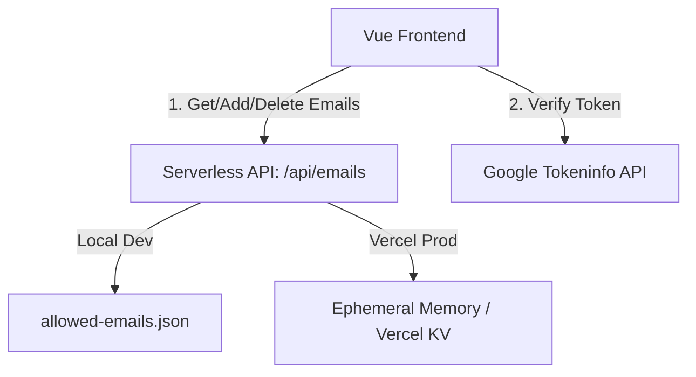

# Google OAuth Login & Email Whitelist Management Plan

This plan introduces a secure Google OAuth login system and email management dashboard to the Slidev presentation deck. It allows only whitelisted emails to view the slides, with the main administrator email (`ponrajacc@gmail.com`) having exclusive access to manage the whitelist.

## User Review Required

> [!IMPORTANT]
> **Google OAuth Client Credentials**
> We will use the Google Client ID configured in your `client_secret_*.json` file:
> `207254417956-4d7idomgvuvp3bsdkg76h0i5lg04ha2r.apps.googleusercontent.com`
> 
> **Redirect URIs & Origins**
> For Google Sign-In to work:
> 1. In local development, Google allows `http://localhost` origins by default.
> 2. For production, the origin `https://slidev-pro.vercel.app` (configured in your client secret) is allowed. If you deploy to a different URL, you will need to add it to the Authorized JavaScript Origins in your Google Cloud Console.

> [!TIP]
> **No External npm Packages Required**
> - The Google Sign-In SDK is loaded dynamically via script injection.
> - Token decoding is performed client-side, and verification on the backend is handled via Google's lightweight `tokeninfo` endpoint.
> - This keeps the build stable, lightweight, and fast.

---

## Proposed Changes

### Backend API & Storage

We will create a Serverless function and a local storage file for the allowed email list.

---

#### [NEW] [allowed-emails.json](file:///d:/slidev-pro-main/slidev-pro-main/allowed-emails.json)
- Pre-seeds the email list with `ponrajacc@gmail.com`.
- Stored as a simple JSON array.

#### [NEW] [api/emails.js](file:///d:/slidev-pro-main/slidev-pro-main/api/emails.js)
- Serverless API endpoint (`/api/emails`) to handle Whitelist Management.
- **GET**: Reads and returns the whitelisted emails.
- **POST / DELETE**:
  1. Decodes and verifies the admin's Google ID Token sent in the `Authorization` header.
  2. Calls Google's tokeninfo API to verify token integrity.
  3. Ensures the authenticated user's email is strictly `ponrajacc@gmail.com`.
  4. Modifies the list and writes back to `allowed-emails.json` (on local dev) or falls back to in-memory/localStorage state (on production/Vercel if write-access is unavailable).

---

### Frontend Components

We will build a high-fidelity, premium interface overlay on top of Slidev.

#### [NEW] [src/components/LoginOverlay.vue](file:///d:/slidev-pro-main/slidev-pro-main/src/components/LoginOverlay.vue)
- **Login Screen**:
  - Full-screen glassmorphic overlay (`z-index: 999999`) preventing interaction with the slides.
  - Premium dark theme with Outfit and Inter fonts, smooth glowing gradients, and subtle fade-in animations.
  - Standard Google Sign-In button.
  - Friendly error messages (e.g. if the signed-in email is not whitelisted).
- **Admin Dashboard Modal**:
  - Visible only to `ponrajacc@gmail.com`.
  - Displays the list of whitelisted emails.
  - Form to add new emails with instant feedback.
  - Delete button for each email (except `ponrajacc@gmail.com`).
  - Synced automatically with the Serverless API (falling back to client `localStorage` if API is offline).

#### [MODIFY] [src/components/GlobalBottom.vue](file:///d:/slidev-pro-main/slidev-pro-main/src/components/GlobalBottom.vue)
- Import and render `LoginOverlay`.
- Keep track of the `isLoggedIn` reactive state.
- Render an Admin Dashboard toggle button (a sleek gear icon) and a Logout button in the footer for authenticated users.

---

## Verification Plan

### Automated/Local Tests
1. Start the Slidev dev server: `npm run dev`.
2. Verify that the slide deck is initially blocked by a gorgeous login screen.
3. Attempt to sign in with a non-whitelisted email; verify it displays an "Access Denied" card.
4. Sign in with `ponrajacc@gmail.com`.
5. Verify the slides are unlocked.
6. Open the Admin Panel via the gear icon in the bottom footer.
7. Add a new email address (e.g., `test@example.com`). Verify it is added to `allowed-emails.json`.
8. Log out and try signing in with `test@example.com`. Verify access is allowed.
9. Sign back in as `ponrajacc@gmail.com` and delete `test@example.com`.
10. Confirm it has been removed from `allowed-emails.json`.
