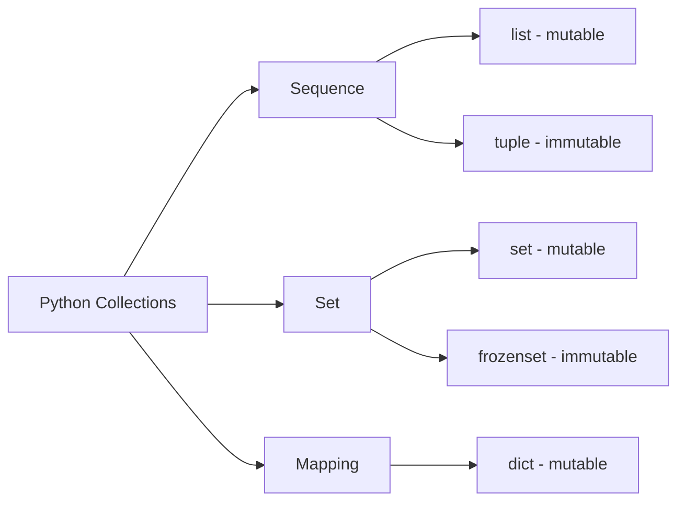

<Slide2 topic="Four Collection Types — Overview">
  <template #content>

The Collection Hierarchy

  

```mermaid {scale: 0.65}
graph LR
    A[Python Collections] --> B[Sequence]
    A --> C[Set]
    A --> D[Mapping]
    B --> B1[list - mutable]
    B --> B2[tuple - immutable]
    C --> C1[set - mutable]
    C --> C2[frozenset - immutable]
    D --> D1[dict - mutable]
```
<!--  -->
  

  </template>
</Slide2>
