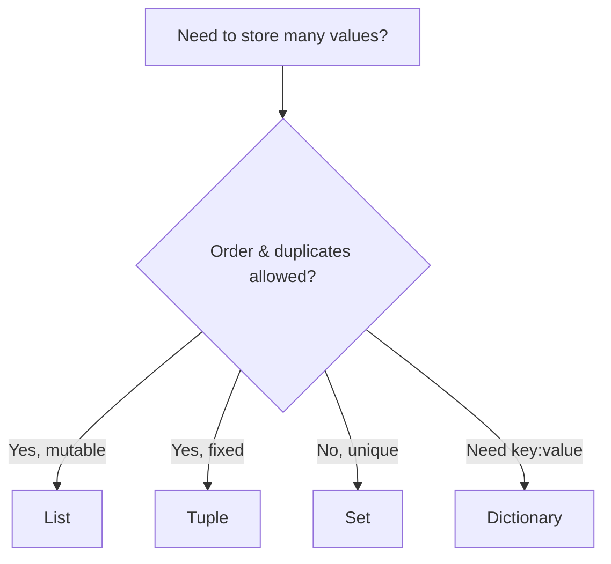

<Slide2 topic="Quick Recap — All Four Collections">
  <template #content>

Quick Recap — Snapshot

```mermaid {scale: 0.6}
graph TD
    Q[Need to store many values?]
    Q --> L{Order &amp; duplicates allowed?}
    L -- Yes, mutable --> LIST[List]
    L -- Yes, fixed --> TUPLE[Tuple]
    L -- No, unique --> SET[Set]
    L -- Need key:value --> DICT[Dictionary]
```

  </template>
</Slide2>
